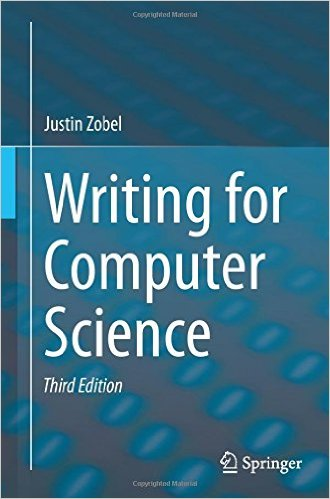

<!-- _class: lead -->
<!-- _paginate: false -->

# 01 introduction

james brusey 
june 2026 

 

---

# contents

- overview of the module
- intended learning outcomes
- learning format
- schedule for the week
- ground rules
- what do you want?
- getting started

---

# overview of the module

- we are following material from a book
- we are adding material that has been helpful to past students
- you can help too — by teaching each other

---

# intended learning outcomes

- design research that produces rigorous results
- locate, appraise, and summarise relevant literature
- write a clear and concise research paper
- present a persuasive presentation on the research paper
- proofread and referee

---

# learning format

- you’ll need your laptop (please go and get it now if you don’t have it)
- minimal lecturing
- mostly class exercises (be open to learn from each other) - measured in pomodoros
- teach each other - learn from each other

---

<!-- _class: lead -->
<!-- _paginate: false -->

# schedule for module

---

# monday

| Time        | Session                               |
| ----------- | ------------------------------------- |
| 09:00–09:10 | Meditation                            |
| 09:10–09:40 | Introduction                          |
| 09:40–10:10 | Expectations activity                 |
| 10:10–10:30 | 3MT introduction & presenting         |
| 10:45–12:15 | Style & sentence construction         |
| 13:00–15:30 | Writing for maths, algorithms & plots |
| 15:45–17:00 | Ethics (Alison Halford)               |

--- 

# tuesday

| Time        | Session                                               |
| ----------- | ----------------------------------------------------- |
| 09:00–09:10 | Meditation                                            |
| 09:10–10:30 | Literature review                                     |
| 10:45–12:15 | Publishing (Matthew England 10–11) + writing exercise |
| 13:00–14:00 | Originality, significance & rigour                    |
| 14:00–15:00 | LLM Ethics (Simon Ellis)                              |
| 15:00–15:30 | Discussion                                            |
| 15:45–17:00 | Editing, proofreading & refereeing                    |

---

# wednesday

| Time        | Session                                         |
| ----------- | ----------------------------------------------- |
| 09:00–09:10 | Meditation                                      |
| 09:10–10:30 | GenAI for PGRs                                  |
| 10:45–12:15 | How LLMs Work                                   |
| 13:00–15:30 | Data analysis & reproducible research pipelines |
| 15:45–17:00 | HPC (Alex Pedcenko)                             |

---

# thursday

| Time        | Session                                            |
| ----------- | -------------------------------------------------- |
| 09:00–09:10 | Meditation                                         |
| 09:10–10:30 | 3MT Presentations (Part 1)                         |
| 10:45–12:15 | 3MT Presentations (Part 2)                         |
| 13:00–15:30 | Machine Learning Essentials (Vasile Palade Part 1) |
| 15:45–17:00 | Machine Learning Essentials (Vasile Palade Part 2) |

---

# friday

| Time        | Session                                                          |
| ----------- | ---------------------------------------------------------------- |
| 09:00–09:10 | Meditation                                                       |
| 09:10–10:30 | Research Toolkit (student-led) + OpenCode + AutoResearch + demos |
| 10:45–12:00 | Reinforcement Learning + Closing + People's Choice Award         |

---

# ground rules

- attend all lectures / exercises
- please come on time
- contribute to group activities
- please help to make it a fun, enjoyable atmosphere for everyone

---

# options for modifying the format

We could
* change the format to a series of seminars
* change to having one day slots - spread 5 days over the year
* keep the same but change the timing

# what do you want?

- Go to the "Expectations for the course" document and start typing what it is you want out of this course starting with 3 dots
- e.g.
- “ … a magic bullet that gets me a PhD!”

<!--
end of this section by 9:30-ish
-->

---

# getting started

- Zobel summarises research thus:
- form a precise question
- develop understanding through reading
- gather evidence
- link question and evidence with an argument
- describe the work in a publication

---

# getting started checklist (Zobel)

- is the proposed topic clearly research?
- is it different from, say, software development?
- what are the area, topic, research question?
- is the project of appropriate scale?
- is it distinct from other’s projects?
- are the outcomes interesting enough to justify the work?

---

# checklist continued

- what skills do you and your supervisor bring?
- what skills must be learnt?
- what resources are required and how will they be obtained?
- what are the likely obstacles?
- can you write down a road map?
- have you agreed on how to work with your supervisor?

---

<!-- _class: lead -->
<!-- _paginate: false -->

# presenting and 3mt

---

# here is an example

  <iframe 
    width="800" 
    height="450" 
    src="https://www.youtube.com/embed/PczCM3GwB4Q" 
    title="YouTube video player" 
    frameborder="0" 
    allow="accelerometer; autoplay; clipboard-write; encrypted-media; gyroscope; picture-in-picture" 
    allowfullscreen>
  </iframe>

---
# 3mt rules
1. one slide, no animations / video
2. presenter 1 has slide 1, p2 has s2, etc
3. running order will be issued day before
4. 3 minutes max (no talking after or risk disqualification)

---

# what to include

1. why (problem)
2. method
3. impact

---

# criteria for success

1. clarity
   * *what* are you trying to say?
   * in what *order*?
   * how much *detail*?
2. engagement
3. significance
4. delivery

--- 

# criteria for success

1. clarity
2. engagement
   * *active* participation
   * *look* at everyone
   * use *props*
   * *exaggerate* body language
   * don't read your slides
3. significance
4. delivery

---

# criteria for success

1. clarity
2. engagement
3. significance
   * whose life will be saved / improved?
   * what is the path towards that?
4. delivery

---

# criteria for success

1. clarity
2. engagement
3. significance
4. delivery
   * umms and ahhs
   * plan your intro
   * end like you deserve a standing ovation
   * (even if you don't get one!)

