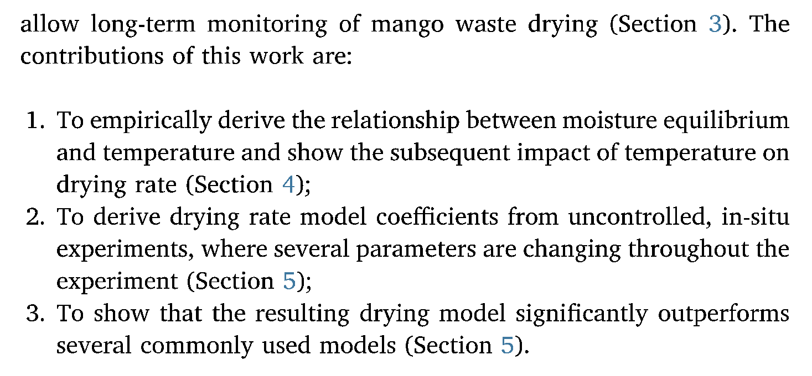
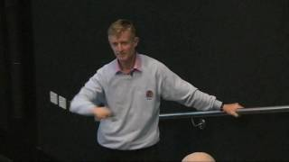

<!-- _class: lead -->
<!-- _paginate: false -->

# 04 style

 

---

# intended learning outcomes

- design research that produces rigorous results
- locate, appraise, and summarise relevant literature
- write a clear and concise research paper
- present a persuasive presentation on the research paper
- proofread and referee

---

# seven simple suggestions

- The following material is based on “How to write a great research paper” talk by Simon Peyton-Jones
- Make a written note of anything you don’t expect

---
<!-- _class: lead -->

# #1: don’t wait - write!

---

# writing papers model 1

idea

research

write paper

---

# writing papers model 2

idea

research

write paper

idea

write paper

research

---

# writing papers model 2

idea

write paper

research

writing is doing research - not just reporting research

- forces us to be clear / focused
- articulates what we don’t understand
- opens the way to collaborate with others

---

# do not be intimidated

fallacy - you need to have a fantastic idea before you can write a paper

write a paper / give a talk on
any idea
no matter how poor you initially think the idea to be

<!--
writing the paper is how you develop the idea in the first place it usually turns out to be more interesting and challenging than you first thought
-->

---

<!-- _class: lead -->

# #2: Identify your key idea

---

# convey a useful / reusable idea

- you want to infect the mind of your reader with your idea
- papers last longer (are more reusable) than programs
- ideas are only useful if they are communicated

---

# the idea

- each paper should have one clear, sharp idea
- you may not know it when you start but must by the time you finish
- if you have lots of ideas, write separate papers

---

# is the idea “audible”

- many papers have good ideas but don’t necessarily state them clearly
- be sure that the reader is in no doubt:
  - “The main idea of this paper is …”
  - “In this section, we present the main contribution of this paper.”

---

<!-- _class: lead -->

# #3: Tell a story

---

# narrative flow

- Imagine explaining at a whiteboard:
- What is the problem?
- Why is it interesting?
- Is it unsolved?
- Idea
- Details of how idea works
- Compare idea to other’s works

I wish I knew how to solve that!

I see how that works! Ingenious!

---

# structure

- Title (1000 readers)
- Abstract (<12 sentences, 100 readers)
- Introduction (1 page, 100 readers)
- The problem (1 page, 10 readers)
- Idea (2 pages, 10 readers)
- The details (5 pages, 3 readers)
- Related work (1-2 pages, 10 readers)
- Conclusions / future work (½ page)

---

# - structure

- A strong structure helps clarify the role of each part of the writing
  - For example, a related work section should only describe past work and not include any new material
- Structure helps avoid repetition
  - e.g., stating the number of human subjects several times
  - Being clear that this information needs to go into a “methods” section reduces this type of repetition
  - Similarly, if you discover repetition, it could be due to poor structure

---

<!-- _class: lead -->

# #4: Nail your contributions

---

# molehills not mountains

- “Computer programs often have bugs [1]. It’s important to eliminate these bugs [2,3]. Many researchers have tried [4-9]. It’s really very important”
- “Consider this program, which has an interesting bug … we will show an automatic method for identifying and removing such bugs”

yawn!

cool!

---

# state your contributions

- write the list of contributions in introduction
- the list of contributions drives the whole paper
- specifically link contributions to sections

---

# state your contributions

---

<!-- _class: lead -->

# Slide 21

---

# evidence

- your intro makes claims
- the body contains evidence to support each claim
- evidence can be: theorem / proofs, experimental results, case studies, or even argumentation

---

# contributions should be refutable

| NO! | YES! |
| --- | --- |
| We describe the WizWoz system. It’s really cool! | We give the syntax and semantics of a language that supports concurrent processes (section 3). Its innovative features are ... |
| We study its properties. | We prove that the type system is sound and that type checking is decidable (section 4) |
| We have used WizWoz in practice. | We have built a GUI toolkit in WizWoz and used it to implement a text editor (section 5). The result is half the length of the Java version. |

---

# no “rest of this paper is structured”

- Instead use the forward references from contributions to provide structure info
- The introduction should survey whole paper, so a “structure” paragraph is just duplication.

---

<!-- _class: lead -->

# #5: Related work (later)

---

# putting related work later

- Title (1000 readers)
- Abstract (<12 sentences, 100 readers)
- Introduction (1 page, 100 readers)
- Related work
- The problem (1 page, 10 readers)
- Idea (2 pages, 10 readers)
- The details (5 pages, 3 readers)
- Related work (1-2 pages, 10 readers)
- Conclusions / future work (½ page)

---

# related work

Fallacy

to make my work look good, I need to make other’s work look bad

---

# the truth: credit is not like money

- Giving credit to others does not diminish the credit you get for your work

- warmly acknowledge work that has helped
- be generous to the competition
- acknowledge weaknesses and limitations in your work

---

<!-- _class: lead -->

# #6: Put your readers first

---

# presenting the idea

- explain as if you were at a whiteboard
- start with the intuition
- once the reader has the intuition, grasping the details will come more naturally
- if the details get skipped, at least the intuition will be understood

---

# how to convey the intuition?

Begin with an
example

- follow with the general case
- explain as if at a whiteboard

---

# putting your readers first

- Do not recapitulate your personal journey of discovery
- choose the most direct route to the idea

---

<!-- _class: lead -->

# #7: Listen to your readers

---

# getting help

- get your paper read by as many people as possible
- experts are good (but so are non-experts)
- each reader can only read your paper for the first time once
- explain what you want (or you may just get spelling advice)

---

# getting expert help

- send the draft to the competition to ask “have I quoted your work fairly?” (but not at the last minute)
- often they’ll respond with helpful critique
- they might be your referees so you can get feedback early this way!

---

# listen to your reviewers

Treat every review like gold dust
Be truly grateful for criticism

- This is really hard but really, really important
- If you are having trouble, leave it aside for a while and come back to it or ask a colleague for an opinion

---

# summary

- don’t wait - write
- identify your key idea
- tell a story
- nail your contributions
- related work (later)
- put your readers first
- listen to your readers

---

# seven simple suggestions

<!--
finish by 10
-->

---

# discussion

which suggestions did you find most surprising or inspirational?

---

# pomodoro technique

www.pomodorotechnique.com

---

# ‘shut-up-and-write’!

https://thesiswhisperer.com/shut-up-and-write/

---

# exercise (1 pomodoro)

- Come up with a research topic (see Zobel p267 ex 1)
- You can write down the title for your research topic plus one research question that your paper will answer

<!--
finish by 10:30 - possible coffee break
-->

---

# abstracts

- See Mike Ashby’s how to write a paper: http://goo.gl/8Ibmf0
- Find the section on how to write an abstract

---

# example abstract

- Abstract Kiln-dried fruit drying time is readily predicted from initial moisture content since the environment is tightly controlled. For uncontrolled environments, such as a greenhouse solar dryer, a product's drying time varies depending on ambient conditions and is thus more difficult to predict. Prediction of the drying time is needed to better schedule dryer use. Data was obtained from a set of wireless scales that weigh the waste during solar drying after initial moisture content measurement of a sample. A set of linear and quadratic models for drying rate are tested with the best yielding a 39% reduction in RMSE over traditional models. The results indicate that the modelling approach is likely to be useful for open solar dryers where the temperature, and thus the drying rate, is not controlled.

---

# Slide 45

---

# exercise (15 mins)

- underneath your title, write a draft abstract applying the rules from Ashby:
- 1-3 sentences for each of
- Motive; (what is the problem, why is it interesting?)
- Method; (how is the problem examined?)
- Results; (what evidence is there?)
- Conclusions (what does it mean to anyone else?)
- If you finish early, please go ahead and review and comment on other people’s abstract.

<!--
11:30 finish
-->

---

# review

- Selecting one or two of the abstracts at random
- can we understand it?
- is it concise?
- are all 4 elements (motive / method, etc) there?
- Things to watch for (and avoid):
- vague statements about how interesting the subject is becoming
- skipping elements (e.g. no statement about method)
- hyperbole

<!--
12:00 finish
-->

---

# exercise (1 pomodoro)

- underneath your title, write a draft abstract applying the rules from Ashby (<= 3 sentences for each of Intro; Method; Results; Conclusions)
- OR
- write a five sentence abstract using Zobel chap 5 guide to abstracts

<!--
11:30 finish
-->

---

# review

- Selecting one or two of the abstracts at random
- can we understand it?
- is it concise?
- Things to watch for (and avoid):
- vague statements about how interesting the subject is becoming
- skipping elements (e.g. no statement about method)
- hyperbole

<!--
12:00 finish
-->

---

# what we didn’t cover in this session

- grammar
- punctuation
- spelling
- and many other things about good writing …
- … but please see the further reading

---

# further reading

- chapters 5, 6, 7, 8 of Zobel
- Elements of Style - Strunk and White
- Coursera - Writing in the Sciences
- and many others!
