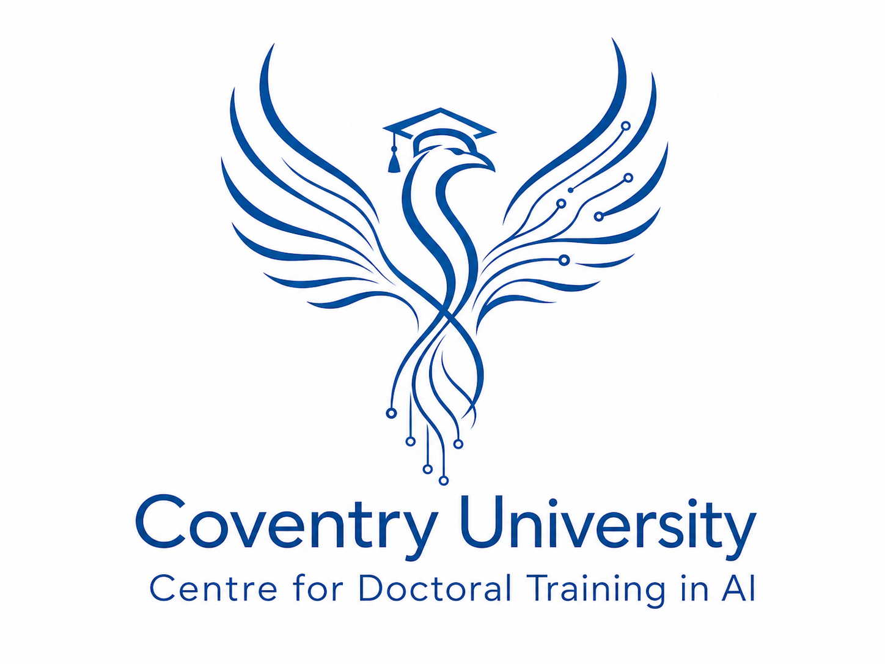

<!-- _class: lead -->
<!-- _paginate: false -->

# 12a refereeing

 

---

# intended learning outcomes

- design research that produces rigorous results
- locate, appraise, and summarise relevant literature
- write a clear and concise research paper
- present a persuasive presentation on the research paper
- proofread and referee

---

# journal review process

- an author submits a journal paper to a journal editor
- the editor then selects several reviewers and sends it on to them
  - in some cases, the author will be asked for suggestions
- each reviewer produces an evaluation report and returns it to the editor
- the editor then may decide to publish, to request revisions, to reject, or to select additional reviewers
- in some cases, rejection leaves open a resubmission

---

# conference review process

- conference reviews need to be done more rapidly and there is some modification to the process
- author submits paper to conference chair
- chair assigns reviewers from TPC
- reviewers score paper
- program chair selects successful papers on basis of scoring
- there is usually no opportunity to resubmit a rejected paper
- reviews tend to be brief

---

# contribution

- does a paper contribute to the body of knowledge?
- if so, it must be:
- original
- valid

---

# originality

- original work:
- has not previously been published
- is significant
- has the potential to impact either causing change in the topic area or by enabling technological development
- ranges from incremental to groundbreaking

---

# validity

- valid research:
- is rigorously demonstrated to be correct
- is reproducible
- is based on sufficiently large samples (if statistical evidence used)
- compares positively with prior work

---

# questions to ask for any paper

- is there a (significant) contribution?
- is it a relevant one?
- are results correct?
- is appropriate literature discussed?
- does the methodology answer the posed question?
- are the proposals and results critically analyzed?
- are appropriate conclusions drawn from the results?
- are the technical details correct?
- could the results be verified?
- are there ambiguities or inconsistencies?
- (Zobel, p24)

---

# questions to ask when reviewing

- is the contribution timely?
- relevant to venue?
- content missing? anything unnecessary?
- will it have broad readership?
- is it understandable, clearly written, presented well?
- does the content justify the length?

---

# review content

- explicit purpose: help decide which papers to accept
- implicit purpose: as a communication channel between scientists
- good reviews should:
- make an adequate case for or against the paper
- provide sufficient guidance to the author
- poor reviews harm the research community
- consider triage - focus review effort on salvageable papers

---

# drafting the review

- be willing to change your mind
- be constructive in your comments
- avoid vague criticisms
- suggest essential references sparingly
- be polite; avoid sarcasm and insult
- use confidential comments to the editor to state your limitations, if any, as a reviewer

---

# for a paper that you accept

- convince yourself it is free from serious flaw
- explain to the editor why it is original, valid and clear
- list major and minor changes needed (if excessive number of errors - recommend that it be proofread)
- take care over checking maths and bibliography

---

# for a paper that you reject

- clearly explain faults
- indicate which parts of the paper are of value
- check the paper carefully unless it is disastrously unreadable or ill-conceived

---

# for all papers

- provide essential references (that were not mentioned)
- reread your review to check that it is fair, specific and polite
- tell the editor about your limitations as a reviewer
- check your review as carefully as you would one of your own papers before submission

---

# when you come to receive a review

- when your own paper is reviewed by others:
- treat reviews as if they were gold dust - treasure them!
- remember that a difficulty that they face in understanding your work might be fixed by making your paper easier to read

---

# test exercise (2 pomodoros)

select a research paper from your previous search and perform a detailed review.
