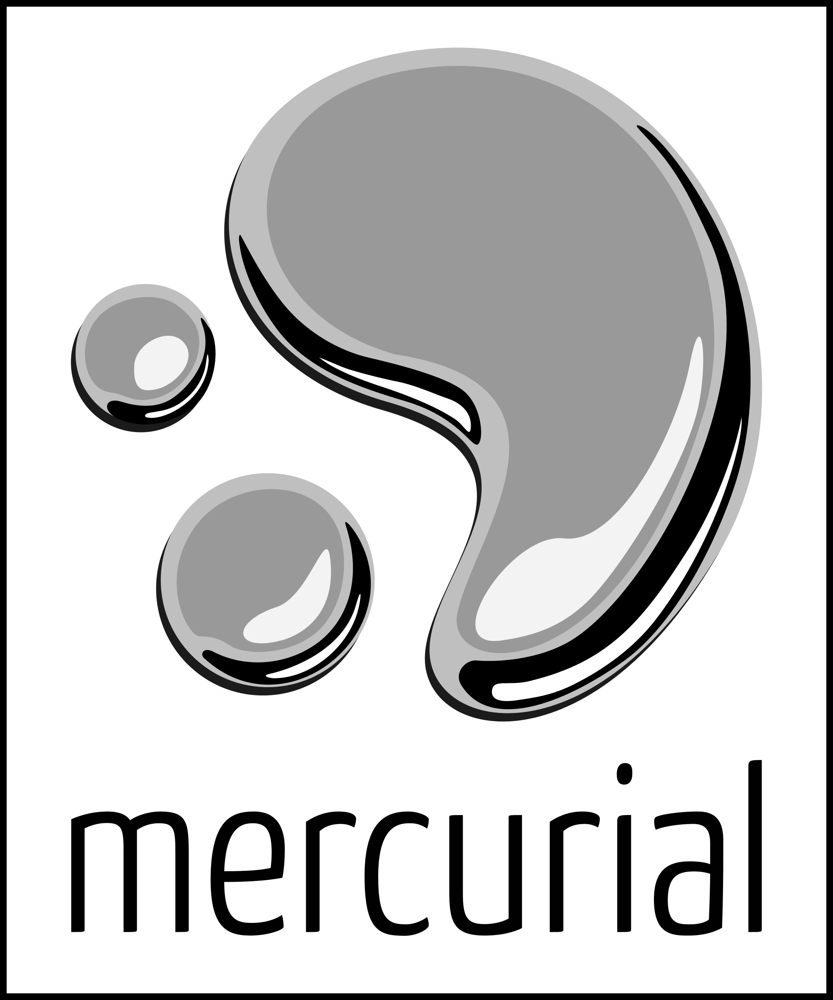
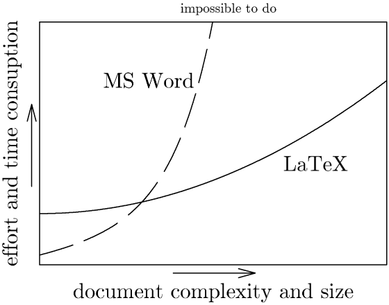
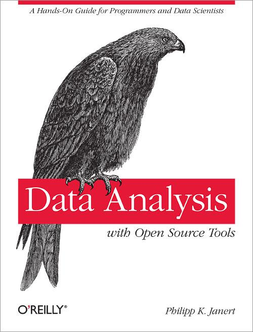
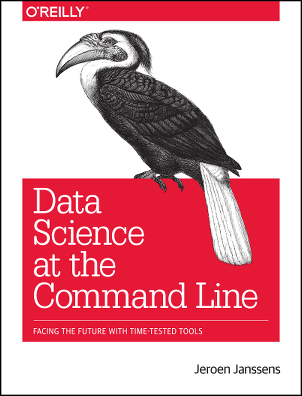

<!-- _class: lead -->
<!-- _paginate: false -->

# 21 research toolkit

 

---

# intended learning outcomes

- design research that produces rigorous results
- locate, appraise, and summarise relevant literature
- write a clear and concise research paper
- present a persuasive presentation on the research paper
- proofread and referee

---

# what’s common about most PhDs?

answer: they’re (almost) all doing data science

---

# data science is OSEMN

- Obtaining data
- Scrubbing data
- Exploring data
- Modelling data
- Interpreting data
- (Janssens (2014) Data science at the command line. O’Reilly)

---

# So what’s wrong with Excel?

- many students try to use excel for data science
- this tends to fail because:
- it can’t handle large data-sets
- workflows cannot be reproduced easily
- it has limited stats tools
- it is difficult to debug or check

---

# a solution?: learn the command line

- https://www.codecademy.com/courses/learn-the-command-line
- See http://datascienceatthecommandline.com/

---

# version control

---

# word processors

---

# New model - markdown

- markdown
- org-mode
- asciidoc

---

# statistics

---

# GNU Make

---

# organisation

- keep a research journal and carry it around
  - useful tip: write longhand journal entries to practise writing
- keep a to-do list (e.g. http://trello.com) ...
- … but avoid busy-work
- schedule e-mail processing for low point
- organise your literature into folders
- consider using a day planner

---

# presentation tools

- ms powerpoint, google slides, apple keynote
- but also consider:
- latex or markdown with beamer
  - great for maths
  - looks very academic

---

# make a home page

- google sites?
- university “mysite” page?
- a “domain of our own” - coventry.domains
- other tools? (personally, emacs and html ;)

---

# Contributed

- tldrthis.com
- github app for Windows
- elicit.org - AI research assistant
- julialang.org - Julia
- researchrabbit.ai
- typeset.io
- mathpix.com
- draw.io
- microsoft planner / microsoft todo
- zotero, betterbibtex, zotero app on ipad
- chatpdf.com

---

# emacs tricks that vs code might have soon

- tramp - ssh connecting to servers
- magit - like github app on windows
- org-mode - markdown on steroids
- org-ref - citations in org documents
