# pgr week

Mathematics, Algorithms, Plots, Diagrams

---

# intended learning outcomes

- design research that produces rigorous results
- locate, appraise, and summarise relevant literature
- write a clear and concise research paper
- present a persuasive presentation on the research paper
- proofread and referee

---

# maths - why to avoid

- maths may put off many readers
- you may just be reproducing proofs or formula found elsewhere for no good reason
- it may not aid comprehension

---

# maths - why to NOT avoid

- (correct) maths forces you to be precise
  - trying to state things mathematically may help you clarify your ideas
- maths may aid in ensuring your approach is reproducible
- well-written maths may aid comprehension

---

# maths

- Strongly recommend LyX or LaTeX
- or possibly:
- http://www.codecogs.com/latex/eqneditor.php
- (but result is pixelated unless you use pdf/svg)

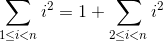

---

# advice from Donald Knuth

- http://jmlr.csail.mit.edu/reviewing-papers/knuth_mathematical_writing.pdf
- Also see: Writing a maths phase 2 paper at MIT http://goo.gl/gqWUUb

---

# sizing parenthesis

Size parenthesis so they wrap their subclauses

Incorrect

Correct

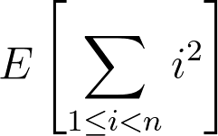

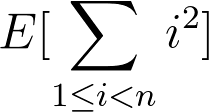

---

# avoid wrong para breaks

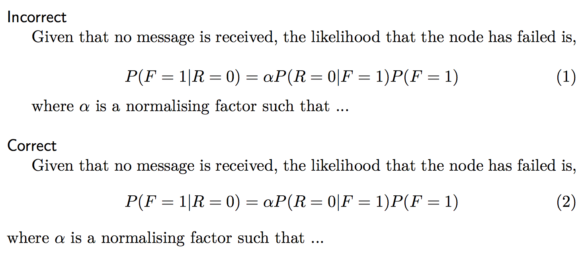

---

# describe every external variable

- Internal variables are like i, s in
- other variables / functions need explanation.
- e.g. what is g?

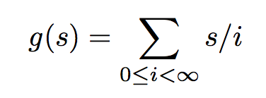

---

# exercise (1 pomodoro)

- Use LyX, LaTeX, or codecogs to typeset the following equation:
- for bonus marks, put parenthesis around the bit being “maxed” so that the brackets are sized correctly

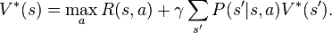

---

# numbers

- See the NIST advice [1] for recommendations on how to quote numerical values (such as 22 deg. C, or 3 min).
- My quick summary:
- 1. Use the correct case (e.g. kWh not KWh or Kwh)
- 2. Put a non-breaking space between the numerical value and the unit (e.g. 3 min not 3min; 2 m/s not 2m/s)
- 3. Use SI units where possible.

---

# expressing uncertainty

- The standard deviation provides an estimate of how well you know a particular measurement. It is, however, an estimate.
- The standard deviation should be expressed to ONE significant figure
- unless the number is between 11 and 19 (times some power of ten) in which case you can use two significant figures
- The number modified by the significant figure should be expressed to agree in place with the standard deviation
- For example, a value resulting from a spreadsheet calculation of an average and standard deviation might be 10.1298 ± 0.2595. This should be expressed as 10.1 ± 0.3 or 10.1 (0.3) where the number in parenthesis is taken to be the estimated standard deviation. The estimate indicates that the value is only known to within three tenths of a unit of measurement. The figures beyond the tenths place, are not significant.

---

# expressing uncertainty

- Where possible, it is more meaningful to provide a 95% (say) confidence interval
- Standard deviation does not give the confidence interval directly (look up std error and t statistic for more info)
- Note: interval may not be evenly distributed around mean (e.g., 97% ± 5%???)
- For further reading, look up measurement uncertainty

---

# algorithms

- algorithms are (only) worth including if they enable reproducibility
- algorithms should not be obvious or readily available elsewhere
- (e.g. showing how to calculate RMSE)
- algorithms should be stated concisely but clearly
- avoid flowcharts - consider pseudocode or literate programming
- avoid using the term “calculate” when it is clear that a calculation is taking place
- avoid * when you mean ×

---

# example

- weighted_sum(v, w):
- for i in range(len(v)):
- wsum += w[i]*v[i]
- return wsum

---

# improved version

- The same idea can be given as a formula:
- Note that algorithmic statements are generally sequential, while equations are timeless, so use ← to make clear you mean assignment

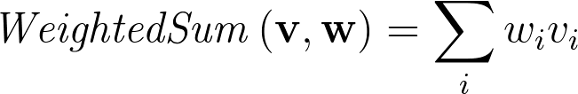

---

# or even without explanation

- ws ← weighted_sum(v, w)
- since the idea of a weighted sum is commonplace

---

# plots - a check-list

- labelled axes with units
- consistent fonts and readable font sizes
- connect points with lines only for continuous axes
- consider boxplots to show distribution shape
- Tufte: minimum ink for maximum information
- size appropriately for eventual format (e.g., for two column report, width should be about 3.5cm)

---

# plots (1? pomodoro)

- use your preferred plotting program to graph the following data:
- https://goo.gl/LNI5wy
- plot any way you like but pay attention to grouping and timestamps

---

# diagrams

- Start with a rough sketch
- Size your canvas appropriately before laying out
- Use a consistent sizing of fonts and lines
- Type consistency
- Try to use standard diagrams
- Be careful with resizing

- Drawing arrows between shapes
- Sizing boxes with text
- Choosing a good colour scheme
- Print out and review
- Check for spelling errors
- A check-list for graphics
- https://jamesbrusey.coventry.domains/writing/drawing-diagrams-and-figures-for-research-articles-and-theses/

---

# examples

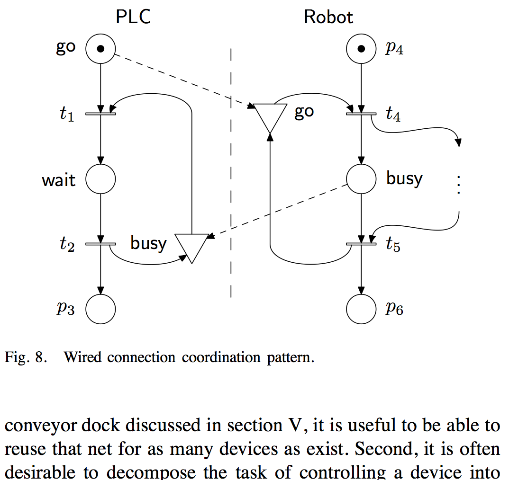

<!--
illustrates use of curved arrows to centroid of box or element (with offset for some arrows to keep them separate) image produced using metapost
-->

---

# original architecture figure

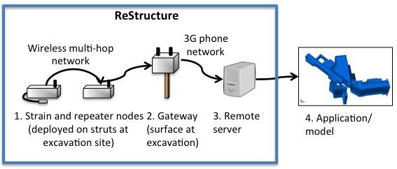

---

# revised architecture figure

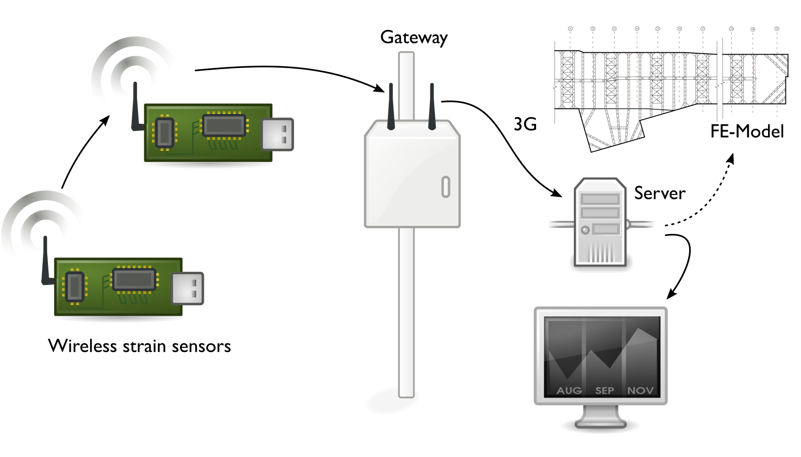

---

# original diagram

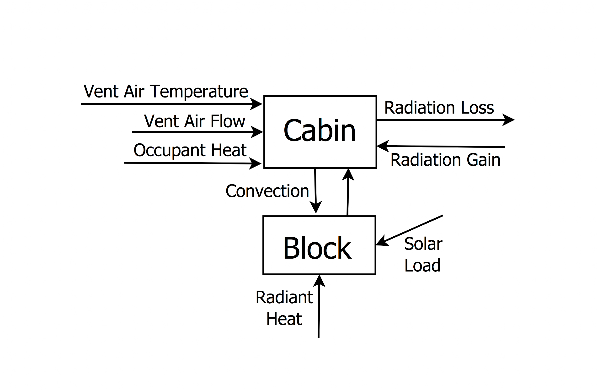

---

# revised diagram

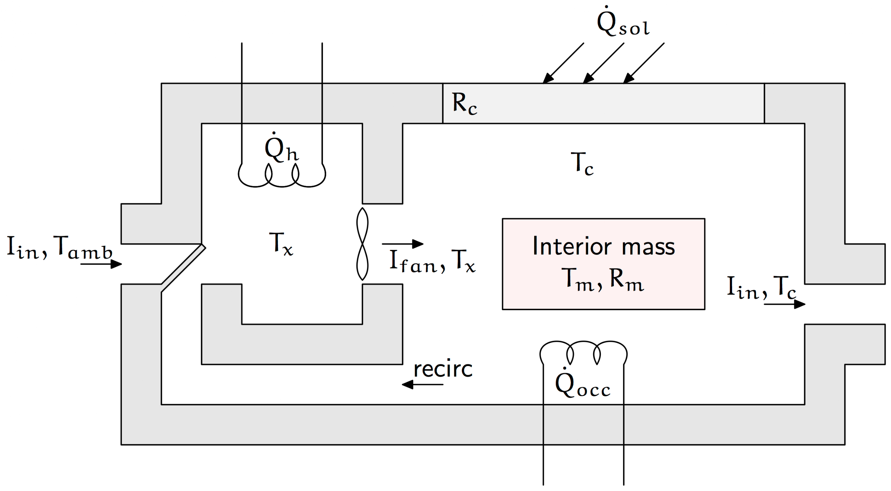

---

# exercise (2 pomodoros)

- roughly sketch a system diagram for your thesis or the research topic you previously proposed
- e.g., a novel car HVAC controller might show the interaction between the car cabin, the blower, heater, air con, control input, etc.
- now: put it into a drawing tool (e.g., inkscape, visio, coreldraw etc) - you may want to review the checklist

---

# review

- swap your diagram with a partner and critique each other’s diagram using the checklist / drawing guidelines
- did you come up with suggestions that disagreed with or were not on the checklist?

---

# exercise (1 pomodoro)

- find a diagram from a paper in your topic area and try to reproduce using vector drawing software package (e.g., inkscape, etc.)
- if the quality of your result is lower, it could be a problem with the tool that you are using.
