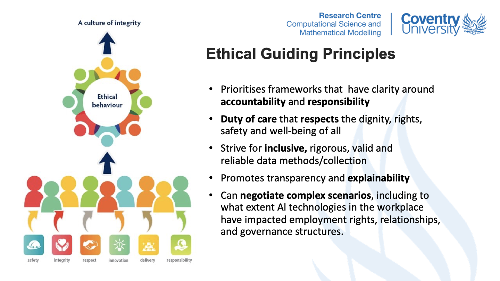
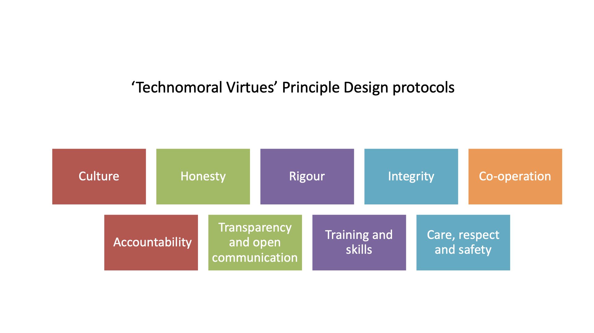
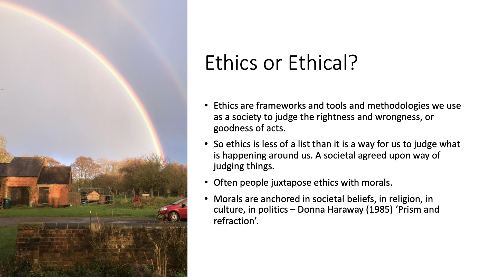
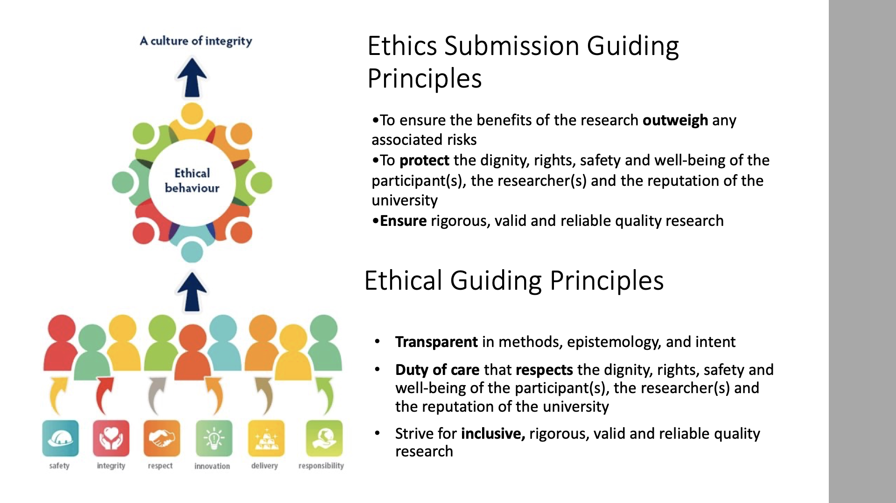
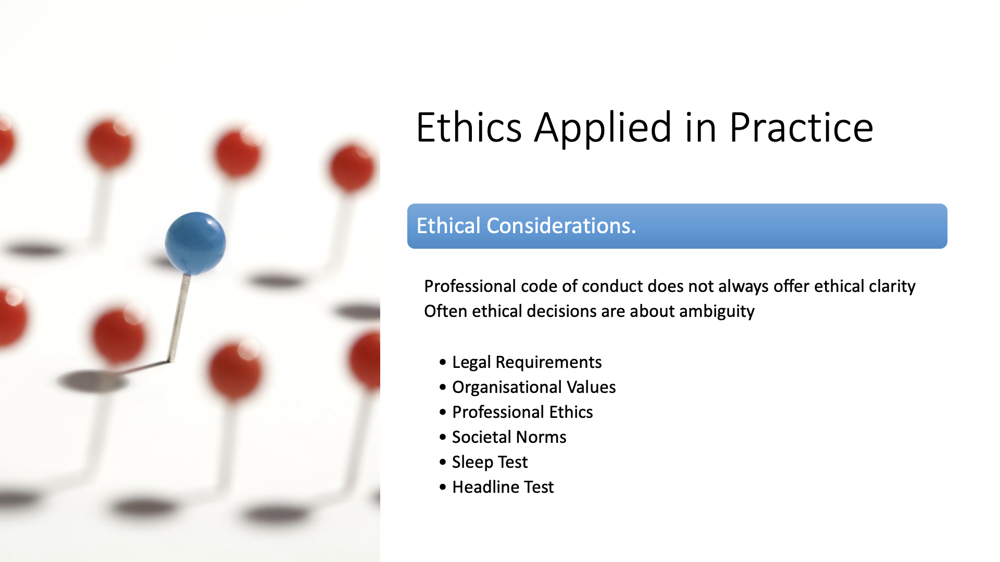

# pgr week

ethics

---

# intended learning outcomes

- design research that produces rigorous results
- locate, appraise, and summarise relevant literature
- write a clear and concise research paper
- present a persuasive presentation on the research paper
- proofread and referee

---

# where do we get our ethics from?

- https://www.slideshare.net/cjrw2/infamous-cases-of-research-misconduct
- Nazi war camp experiments led to the Nuremberg code

---

# Nuremberg code

- Required is the voluntary, well-informed, understanding consent of the human subject in a full legal capacity.
- The experiment should aim at positive results for society that cannot be procured in some other way.
- It should be based on previous knowledge (e.g., an expectation derived from animal experiments) that justifies the experiment.
- The experiment should be set up in a way that avoids unnecessary physical and mental suffering and injuries
- It should not be conducted when there is any reason to believe that it implies a risk of death or disabling injury.

---

# Nuremberg code continued

- The risks of the experiment should be in proportion to (that is, not exceed) the expected humanitarian benefits.
- Preparations and facilities must be provided that adequately protect the subjects against the experiment’s risks.
- The staff who conduct or take part in the experiment must be fully trained and scientifically qualified.
- The human subjects must be free to immediately quit the experiment at any point when they feel physically or mentally unable to go on.
- Likewise, the medical staff must stop the experiment at any point when they observe that continuation would be dangerous.

---

# Slide 6

- Milgram experiment - 1961
- Zimbardo prison experiment - 1971

<!--
On June 10, 1964, the American Psychologist published a brief but influential article by Diana Baumrind titled "Some Thoughts on Ethics of Research: After Reading Milgram's' Behavioral Study of Obedience.'" Baumrind's criticisms of the treatment of human participants in Milgram's studies stimulated a thorough revision of the ethical standards of psychological research. She argued that even though Milgram had obtained informed consent, he was still ethically responsible to ensure their well-being. When participants displayed signs of distress such as sweating and trembling, the experimenter should have stepped in and halted the experimen Zimbardo and his colleagues (1973) were interested in finding out whether the brutality reported among guards in American prisons was due to the sadistic personalities of the guards (i.e., dispositional) or had more to do with the prison environment (i.e., situational). Approval for the study was given by the Office of Naval Research, the Psychology Department and the University Committee of Human Experimentation.For example, prisoners and guards may have personalities that make conflict inevitable, with prisoners lacking respect for law and order and guards being domineering and aggressive. Alternatively, prisoners and guards may behave in a hostile manner due to the rigid power structure of the social environment in prisons. Zimbardo predicted the situation made people act the way they do rather than their disposition (personality).
-->

---

# Nuremberg code continued

- The risks of the experiment should be in proportion to (that is, not exceed) the expected humanitarian benefits.
- Preparations and facilities must be provided that adequately protect the subjects against the experiment’s risks.
- The staff who conduct or take part in the experiment must be fully trained and scientifically qualified.
- The human subjects must be free to immediately quit the experiment at any point when they feel physically or mentally unable to go on.
- Likewise, the medical staff must stop the experiment at any point when they observe that continuation would be dangerous.

<!--
Shannon vallor • Human-centric cyber-physical systems emerge from the interconnectedness between society and technology. Therefore, constructing ethical frameworks that reflect how technology and humans are mutually informed by their respective decision-making Human-centric cyber-physical systems emerge from the interconnectedness between society and technology. Therefore, constructing ethical frameworks that reflect how technology and humans are mutually informed by their respective decision-making will require systems that go beyond risk aversion and 'technology first' top-down measures. Instead, developing a holistic framework, which is context specific, removes silos of knowledge, and includes diverse voices, will generate ethical practices that can build technological capacity, promote societal resilience, and generate a more inclusive, fair, and just workplace • All decision making is understood to have varying degrees of dependence and interdependence .
-->

---

# Slide 8

---

# Slide 9

---

# Plagiarism

- taking someone else’s work and passing it off as your own
- literal copying of a sentence (even with citation)
- copying an image without permission (even with citation)
- pretending that an idea or concept is original when it is not

---

# Self plagiarism

- Recycling your own work is “self-plagiarism”
- e.g., submitting same paper to two journals
- substantial copying between different papers
- Note: some limited copying may be ok (e.g., reusing parts of background or preliminary intro)

---

# Fabrication

Generating or significant alteration of experimental results (whether or not the hypothesis is correct)

---

# Trimming

Dropping points or smoothing data without declaration

---

# Cooking

Deliberate removal of negative results to suit some hypothesis (whether or not hypothesis is correct)

---

# Authorship

- The Vancouver Protocol provides the basic rules
- Remember to discuss authorship early

---

# Confidentiality

- Materials sent for review should be treated as confidential by reviewers and disposed / deleted after the review has completed
- In particular, grant proposals may contain salaries

---

# Privacy and Data Protection

- Data protection law safeguards certain types of data (e.g., personal data, such as names and addresses)
- Please make yourself aware of the law before collecting this type of data

---

# Conflict of interest

- Declare conflicts of interest if reviewing papers that are very close to your own, soon to be published papers
- In grant review panels, declare any collaborations / coauthorship up front

---

# Privacy and Data Protection

- Data protection law safeguards certain types of data (e.g., personal data, such as names and addresses)
- Please make yourself aware of the law before collecting this type of data

---

# whole group discussion

what personal experiences have people had of ethical issues?

---

# exercise

In groups, discuss the problem of a professor that insists on being a coauthor on all the papers for his group. Under what circumstances do you consider this acceptable or unacceptable?

---

# exercise 2

consider an experiment with developing a fall detector for the elderly. In groups, discuss possible ethical issues with performing human trials (and possible solutions)
