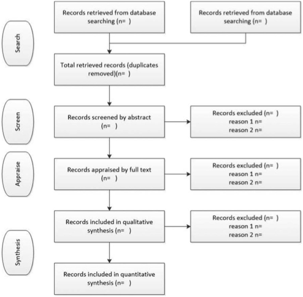

# pgr week

Literature search / review

---

# intended learning outcomes

- design research that produces rigorous results
- locate, appraise, and summarise relevant literature
- write a clear and concise research paper
- present a persuasive presentation on the research paper
- proofread and referee

---

# what’s the point of reading?

- the aim of reading research literature is to gain understanding
- the key to successful reading is to be able to see the value / contribution of a paper, while recognising its flaws

---

# dealing with literature

- by the time you hand in your thesis, your understanding of the literature should be comprehensive
- consider, by preference, only reputable sources
- skim read or browse initially
- avoid wasting time on poor papers
- catalogue and organise papers into folders
- don’t allow reading to become procrastination
- never cite or write about a paper you haven’t read

---

# finding literature

- search the web with obvious terms
- use academic search engines (google scholar, scopus, researchgate)
- visit websites for research groups / researchers in the area
- follow citation references in relevant papers (backward chaining)
- forward chain from very strong papers also - what papers cited this one?
- search publisher specific engines (ACM, IEEE)
- search for articles in your target journal
- use your library catalogue
- use online thesis repositories such as DART and http://ethos.bl.uk
- physically go to the library
- discuss your topic with others

---

# assessing the results

- searching for literature will help you to refine your search terms
- you may also need to repeat your search close to the end of your writing to adjust for the learning gained
- keep searching and reading as separate activities
- after searching, your topic may not look original (so possibly don’t waste time on it) but be aware that an original contribution may still be possible

---

# reading critically

- is there a (significant) contribution?
- is it a relevant one?
- are results correct?
- is appropriate literature discussed?
- does the methodology answer the posed question?
- are the proposals and results critically analyzed?
- are appropriate conclusions drawn from the results?
- are the technical details correct?
- could the results be verified?
- are there ambiguities or inconsistencies?
- (from Zobel, p. 24)

---

# developing a literature review

- start by producing a summary of each paper you read (can be in “note to self” style). Focus on contribution; obvious flaws; possible counter-arguments
- gradually revise, discarding some, less relevant papers
- emerge a strong structure and ensure your text explains the topic area
- consider developing a taxonomy to show area structure
- consider tabulating papers to summarise details (e.g. number of experiments)

---

# Systematic review

- http://prisma-statement.org/PRISMAStatement/FlowDiagram.aspx
- Gough, D., Oliver, S., Thomas, J. (2012). An introduction to Systematic Reviews. London: Sage.

---

# exercise (1 pomodoro)

go through the “finding literature” checklist (apart from visiting the library) for your chosen research topic

---

# exercise (1 pomodoro)

- select a few papers from your search and browse through / skim read to gain a rough assessment
- aim to find at least one interesting paper that would be worth more detailed reading

---

# exercise (1+ pomodoros)

- select an interesting paper from the previous exercise and read it in detail - you may want to print it out first
- write a brief answer to each of:
- what are the researchers trying to find out?
- why is the research important?
- what things were measured?
- what were the results?
- what do the authors conclude? and what factors do they attribute to their findings?
- can you accept the findings as true? Discuss any failings or shortcomings.
- (Zobel, p268)
