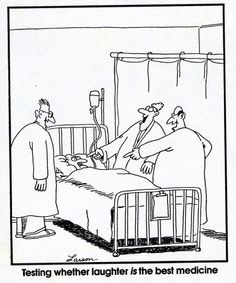
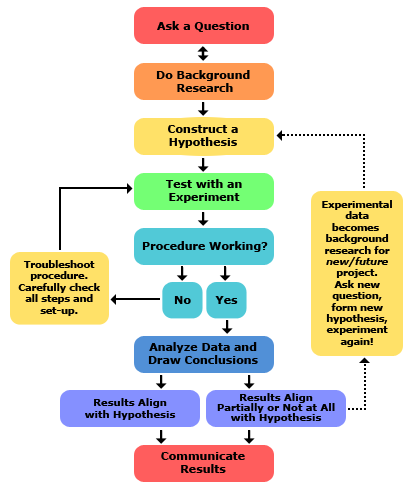
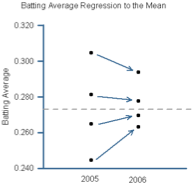
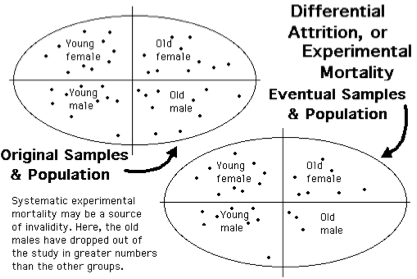

# pgr week

experiments and research questions

---

# intended learning outcomes

- design research that produces rigorous results
- locate, appraise, and summarise relevant literature
- write a clear and concise research paper
- present a persuasive presentation on the research paper
- proofread and referee

---

# Slide 3

---

# Slide 4

---

# exercise

- How would you study the “quality” of this course? How good is it? Does it achieve its aims?
- In groups, come up with a research question that asks this type of question more precisely.

---

# review

- probably we found many ways to pose this question
- interestingly different questions will lead us to use different experimental methods
- it will also lead to potentially different conclusions (although hopefully not conflicting ones)

---

# critical thinking checklist

- Identify what's important:
- What are the key ideas, problems, arguments, observations, findings, conclusions?
- What evidence is there?
- Distinguish critical from other types of writing (eg descriptive); fact from opinion; bias from reason
- Evaluate what you find:
- Explore the evidence - does it convince?
- What assumptions are being made and inferences drawn?
- Is there engagement with relevant, up to date research?
- How appropriate are the methods of investigation?
- Is there a consistent and logical line of reasoning?
- Do you agree with what's being said? Why?
- How is language being used (emotive, biased etc.)?

- Look beyond what you're reading/hearing:
- What other viewpoints, interpretations and perspectives are there? What's the evidence for these? How do they compare?
- How does your prior knowledge and understanding relate to these ideas, findings, observations etc.?
- What are the implications of what you're reading/hearing?
- Clarify your point of view:
- Weigh up the relevant research in the area
- Find effective reasons and evidence for your views
- Reach conclusions on the basis of your reasoning
- Illustrate your reasons with effective examples

---

# identify what's important

- What are the key ideas, problems, arguments, observations, findings, conclusions?
- What evidence is there?
- Distinguish critical from other types of writing (eg descriptive); fact from opinion; bias from reason

---

# - evaluate what you find

- Explore the evidence - does it convince?
- What assumptions are being made and inferences drawn?
- Is there engagement with relevant, up to date research?
- How appropriate are the methods of investigation?
- Is there a consistent and logical line of reasoning?
- Do you agree with what's being said? Why?
- How is language being used (emotive, biased etc.)?

---

# look beyond what you're reading/hearing

- What other viewpoints, interpretations and perspectives are there? What's the evidence for these? How do they compare?
- How does your prior knowledge and understanding relate to these ideas, findings, observations etc.?
- What are the implications of what you're reading/hearing?

---

# clarify your point of view

- Weigh up the relevant research in the area
- Find effective reasons and evidence for your views
- Reach conclusions on the basis of your reasoning
- Illustrate your reasons with effective examples

---

# exercise

- How good is this course? Based on the previous research question:
- Discuss the question in your groups and come up with 3 or 4 different experiment designs that would answer it

---

# different types of research design

- case studies
- one group pre-test post-test design
- static group comparison
- true experimental design

---

# case study

- why?
- rare instances?
- may still be informative
- why not?
- cannot analyse statistically
- one-off may really be a one-off

---

# group pre-test post-test design

experiment group

pretest

treatment

post-test

- why?
- shows change in variable, before versus after

why not?
- no randomised selection
- no control group

---

# static group comparison

<!-- TODO: Grouped layout was flattened; review ordering/layout. -->

experiment group

treatment

post-test

control group

post-test

- why? / why not?
- control / experiment selection should be random

<!--
control group avoids maturation threat but note that there is no pre-test now
-->

---

# true experimental design

- For an experiment to be considered a true design:
- The sample groups must be assigned randomly.
- There must be a viable control group.
- Only one variable can be manipulated and tested. It is possible to test more than one, but such experiments and their statistical analysis tend to be cumbersome and difficult.
- The tested subjects must be randomly assigned to either control or experimental groups

---

# research validity

<!-- TODO: Grouped layout was flattened; review ordering/layout. -->

Outside the study: External validity
Does the same thing happen in other settings?
Other labs?
Everyday settings?

Inside the study:
Internal validity
Was the research done “right”?

---

# threats to internal validity

- History
- Maturation
- Testing
- Instrumentation
- Statistical regression to mean
- Selection bias
- Experimental mortality
- Resentful demoralization of the control group
- + any interactions between the above…

---

# threats to internal validity

- History
  - Something that happened other than [xxx] (tornado, budget cut, season change)
- Maturation
- Testing
- Instrumentation
- Statistical regression to mean
- Selection bias
- Experimental mortality
- Resentful demoralization of the control group
- + any interactions between the above…

---

# threats to internal validity

- History
- Maturation
  - Something that happened in the individuals (hunger, growth, age, sickness)
- Testing
- Instrumentation
- Statistical regression to mean
- Selection bias
- Experimental mortality
- Resentful demoralization of the control group
- + any interactions between the above…

---

# threats to internal validity

- History
- Maturation
- Testing
  - Taking a test again and getting better at taking the test
- Instrumentation
- Statistical regression to mean
- Selection bias
- Experimental mortality
- Resentful demoralization of the control group
- + any interactions between the above…

---

# threats to internal validity

- History
- Maturation
- Testing
- Instrumentation
  - Changes in the calibration of a measuring instrument (change in how you diagnose), observers, scorers
- Statistical regression to mean
- Selection bias
- Experimental mortality
- Resentful demoralization of the control group
- + any interactions between the above…

---

# threats to internal validity

- History
- Maturation
- Testing
- Instrumentation
- Statistical regression to mean
  - Selecting outliers for your study that “regress” (go back) to the mean or average.
- Selection bias
- Experimental mortality
- Resentful demoralization of the control group
- + any interactions between the above…

---

# threats to internal validity

- History
- Maturation
- Testing
- Instrumentation
- Statistical regression to mean
- Selection bias
  - Selecting people for your study on the basis of their scores
- Experimental mortality
- Resentful demoralization of the control group
- + any interactions between the above…

---

# threats to internal validity

- History
- Maturation
- Testing
- Instrumentation
- Statistical regression to mean
- Selection bias
- Experimental mortality
- Resentful demoralization of the control group
- + any interactions between the above…

---

# threats to internal validity

- History
- Maturation
- Testing
- Instrumentation
- Statistical regression to mean
- Selection bias
- Experimental mortality
- Resentful demoralization of the control group
- + any interactions between the above…

---

# threats to internal validity

- History
- Maturation
- Testing
- Instrumentation
- Statistical regression to mean
- Selection bias
- Experimental mortality
- Resentful demoralization of the control group
- + any interactions between the above …

---

# External threats to validity

- Reactive or interactive effects of testing
- I figure out what you are looking for from the questions you are asking me, the teacher tries harder when s/he knows his/her course is being evaluated
- Reactive effects to experimental setting
- Acting differently when being videotaped, in a lab, etc.
- Multiple treatment interference
- When you take a course in writing, you may also be taking other writing courses at the time which may impact outcomes
