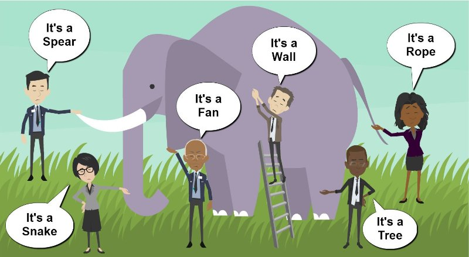

# How to facilitate / support impact / partnership building / international collaboration / commercialisation

- - Understand research impact and its precursors (i.e., pathways to impact)
- - Be able to guide proposals towards greater impact
- - Understand the importance of industry collaboration and international reach to strengthen impact

‹#›

---

# - Aims of this Session

- Delivering Research with Impact
- Stakeholder interest and benefits realisation.
- Planning and delivering research impact.
- Commercialisation and intellectual property
- Collaboration and international partnerships

---

# Slide 3

- Impact

- ‘Impact is defined as an effect on, change or benefit to the economy, society, culture, public policy or services, health, the environment or quality of life, beyond academia’ A provable change in the real world, as a result of research

UK, EU and international funders frequently ask for impact plans and reports to demonstrate to investors value for money.
Impact is about ‘real world’ change. It requires planning before, during and even after the life of the grant.
PIs are often focused on the research objectives and the immediate contract deliverables. It’s often the role of the management professionals to coordinate, facilitate and record the impact of a research project.

---

# - Who has an interest in your research project?

- Stakeholder: an employee, investor, customer, etc. who is involved in or buys from a business and has an interest in its success.
- (Cambridge English Dictionary)

The university wanting to spin out more success?
Partners wanting to exploit economic opportunities?
Funders wanting to report on achievements?
Investors looking for new opportunities?
Participants hoping to gain something from collaboration?
Potential customers with unmet needs?

- Understanding stakeholder interests and influence is crucial to realizing what value the research may have for your organization and for others.
- This is the first step to identifying what impact the research has the potential to achieve.

<!--
This is intended to frame the discussion about benefits realization : who benefits from the research, what is their interest and what value might they provide. The audience should be asked who they believe are research project stakeholders and why they believe that.
-->

---

# - Activity - Identifying interest

| What impact could the project achieve in terms of public policy? |
| --- |
| What might be the funder’s objectives and interests in backing the project? |
| What is the commercial value for the university? |
| Can partnerships be built on or expanded? Other strategic partners? Other international partners |
| How might the SMEs benefit? |

On your tables take 10 minutes to identify:

- CASE STUDY : electric vehicle and smart mobility supply chain mapping project
- Project to identify key opportunities for the transformation of the small business supply chain for new transport technologies in air, sea, road, rail and smart mobility. Partnership includes universities and small business networks.

<!--
This is a real life case-study, based on EU funding for a £1.4M project. What impact could the project achieve in terms of public policy? This was influential in policy around EU and national policy for research funding, innovation funding, the development of industry networks and regional clusters and the acquisition policies of multinationals. What might be the funder’s objectives and interests in backing the project? The funder wanted to see activity that had a direct influence in providing advice to SMEs to help improve their innovation metrics, but at the same time, it was intended to help provide roadmaps for clusters and for EU policy. What is the commercial value for the university? On-going partnerships led to further funding; IP enabled the university to support consultancy for SMEs and regional innovation policy. Can can partnerships be built on or expanded? During the life of the project it expanded to include involvement from other similar projects; involvement of automotive OEMs and suppliers; as well as involving more EU clusters, industry bodies and satalite research in Japan and USA. How might the SMEs benefit? SMEs are hard pressed for time and want tangible, actionable insight that can give them new connections or better position propositions in the market.
-->

---

# Slide 6

- Impact

- Impact is:
- A definable change
- Beyond academia
- As a result of our research
- Provable
- Examples:
  - Change in policy
  - Increased effectiveness of..
  - Improved wellbeing of..
  - Reduced costs
  - Improved sales

- Impact isn’t:
- Dissemination
- Communication
- Partnerships
- Unlinked to research
- Academic publications

© J.Bayley 2015

<!--
Important to distinguish between promotion of research and policy change. In short, there must be the administrative capacity to: plan for social/economic change, facilitate change, to track the change and to demonstrate that it is related to the project – e.g. through testimonials, mentions in policy papers, changes in funding.
-->

---

# Slide 7

<!-- TODO: Grouped layout was flattened; review ordering/layout. -->

- Think

- Impact - Example

Electric Vehicle Supply Chain Example
Think: We aim to change EU innovation investment policy.
Plan: We need to identify who needs to be involved (e.g. EU, national actors, regions, organisations) what interests they have and what influence/resources they can bring.
Write: We start off with a plan but will often need to update and change it as we…
Do: Bring in new partners, work with them on developing plans, identify resources they can put to common aims. With activities often continuing after the project results.
Capture: We need to be able to identify what the change was, how it was made, and what the connection is to the research (i.e. five years on have the principles informed policy in the German electric vehicle industry?)

- Capture

- Plan

- Do

- Write

<!--
In this example there was a plan to deliver and policy guidance at a number of levels – EU, national and regional policy clusters. This meant that we needed to involve representatives from these organisations in the early stages of planning. As we delivered the research, the plan changed and we had to change with it bringing in new partnerships. Administrative staff needed to systematically evidence what change occurred through our partners, and make the case for future monitoring capacity.
-->

---

# - Commercialisation

| Knowledge Exchange and Business Development | Promote and support knowledge exchange and transfer activities |
| --- | --- |
| Technology Transfer | Provide support for technology transfer activities such as identifying opportunities, brokering relationships, licensing IP, creating ‘spin out’ companies |
| Supporting CPD Courses | Identify opportunities and provide sound administrative support for CPD course provision |

- Commercialisation is the process of ‘translating’ research into a commercial product.

- May relate to new business development, applied research funding, consultancy, CPD or spin-outs.
- Often requires careful early thinking about IP management, contracts, partner management and publication of IP.
- Facilitation is a key skills for bringing in commercial expertise and new thinking at different stages of projects.

Development Framework Skills

<!--
Impact is about maximizing gains for society. Commercialisation is about maximizing value for money gains for specific organisations (usually your own) It requires a mindset focused on identifying and safeguarding the potential value of IP, and to bring in expertise to recognize how that value can be realized in product terms. Commercial staff are crucial here, both in terms of their expertise, but also recognizing when to push an opportunity if an academic is only focused on the research outpus.
-->

---

# - Activity - Managing Intellectual Property

| What is the intellectual property (IP) for the university coordinating this? |
| --- |
| What benefits could be achieved from that IP for the university? |
| Who might need to be brought in to help achieve that benefit? |
| What agreements need to be in place at the start to avoid conflict? |
| What does the research team need to know to avoid releasing confidential details? |

- CASE STUDY : electric vehicle and smart mobility supply chain mapping project
- Project to identify key opportunities for the transformation of the small business supply chain for new transport technologies in air, sea, road, rail and smart mobility. Partnership includes universities and small business networks.

On your tables take 10 minutes to identify:

<!--
The university can gain from and understanding of future technology trends, regional innovation policy and SME growth policies. The university stands to benefit from: and understanding of future technology trends (for consulting with large businesses), providing guidance to national and regional bodies on innovation policy, and providing knowledge transfer advice to SMEs. The university might seek to partner with an industry association in the automotive sector, a consultancy or a major business partner in the automotive supply chain to increase commercial research, recognition and credibility. Background and foreground IP needs to be secured at the start with consortia; new partners need non-disclosure agreements and memorandums of understanding. UNIVERSITY HAS TO UNDERSTAND ITS OWN POTENTIAL COMMERCIAL INTEREST as early as possible. The research team needs to know what IP can be disclosed in publications or conferences; they must know the potential options for commercializing IP and have regular update meetings with commercial staff.
-->

---

# - Collaboration

- ‘Collaboration occurs when a number of institutions or individuals make a commitment to work together and contribute resources to obtain a common long-term goal’

Why Collaborate?
- It is a ’force multiplier’ expanding access to expertise, capacity and reach.
- Collaboration can enable the development of more permanent teams, networks and institutions.
- Creates a diversity of perspectives often crucial to innovation, adapting to diverse viewpoints, or finding new problem/solution fits.

Challenges
- More partners means more management of complexity
- Contracts and agreements need to reflect the differing interest of stakeholders, especially around IP.
- Collaboration can expand the impact and life of the project beyond the research itself, but dedicated management is needed so the PI doesn’t become overwhelmed.

<!--
Challenges appears ‘on click’
-->

---

# Slide 11

<!-- TODO: Grouped layout was flattened; review ordering/layout. -->

- Collaboration

- Institutional collaboration

- Stakeholder networks

Strategic Partnerships, Institutional Leadership
Public Relations

- Research Partners

Non-Disclosure Agreements, Advisory Boards, Communications

- Research Office (s)

Collaboration Agreement, Terms of Reference, IP agreement

- Funder &
- Academic Lead

Engaging internal & partner contacts in legal, HR procurement and media.

Funder Offer, Contract – formal and informal funder expectations

<!--
Different levels of collaboration require different levels of formal and informal agreements. There are formal contracts but also a need for more systematic communications and engaging leadership and public bodies at a strategic level.
-->

---

# - International Collaboration

- International collaboration is increasingly vital to forge strategic partnerships, expand reach and research demonstrate validity beyond one market or culture.
- BUT
- Different jurisdictions operate different formal and informal practices
- Cultural practice and languages need to be factored in to anticipate risks
- Due diligence is often needed where the validity of a partner harder to ascertain.

<!--
International collaboration has a longer learning curve. There are often not the same levers of common understandings, influence and enforcement of obligations and new modes of operation have to be learnt. As such it is best to work between as many known contacts as possible in developing funding bids to reduce the learning time and to deliver over longer timescales to avoid an early risk or problem derailing the schedule.
-->

---

# - One meeting may not be enough to establish similar expectations….

Formal rules are needed for managing consortia…
…but informal meetings and individual catch-up discussions are important to identify different interests, approaches and expectations.

<!--
Old parable from South Asia (original origin not known) of a group of blind asked to describe an elephant and all encountering a different part described a different creature. International collaboration is similar. Together a much more complete view of a problem might be achieved, but individually it can be incomplete and there is a learning curving in bringing together individual perspectives into a common understanding.
-->

---

# - Activity - Building partnerships beyond the contract

- Case-Study: Major Events Legacy
- A project is won to provide international mobilities for researchers working on projects around major events planning and how this can create better events, urban environments, regeneration or healthy living.
- The funder, PI and university believe that with the Olympics coming to your city, this project has significant potential to attract more funding, raise visibility and create something lasting.

20 minute activity, on your table consider:
- What are the opportunities for a lasting impact? Agree one.
- What are the risks if the university mishandles the project and the opportunity?
- What internal expertise do you need within the university? Name give colleagues and when they need to be involved.
- What are the partnerships that need to be established at a city, national and international level? Name three, and identify the benefits for you and for your partners.
- Do you need to make a case for more funding? If so, to whom - the university, a sponsor or the funder? How do you define success?

<!--
This is based on a real case study called CARNIVAL where Coventry won funding to look at the impact of London 2012, together with partners from Brazil, USA and South Africa. Coventry gained addition funding, PR and support from London’s Olympic Legacy organisation in providing unique access to ministerial contacts to look at urban regeneration opportunities for Rio 2016 and Birmingham Commonwealth Games, 2022 Games. High level of contact, brought higher level of PR risks and reputational risks, requiring the mobility scheme to appear professional and focused on tangible outputs – need to optimize publicity and high level policy connections. Establishing a long-lasting network between past and future Olympic and major event cities put Coventry in a highly strategic position to influence policy and attract future funding. HOWEVER a case did need to be made to the university to subsidise the cost of the maintainence of this network beyond the life of the project.
-->

---

# - Key Points

- Impact planning is about expanding the scope of the project to identify how social or economic change can be achieved as a result of the research.
- Commercial planning is about identifying, protecting and exploiting the commercial value of the project for your organisation
- All impact and commercial planning will require collaboration with internal or external stakeholders. This requires planning, focus and leadership, but also access to diverse specialist skills if the project is to be a success.

---

# What is research impact?

- “an effect on, change or benefit to the economy, society, culture, public policy or services, health, the environment or quality of life, beyond academia”
- — UK Research Excellence Framework (REF)

‹#›

<!--
Slides from here are from James
-->

---

# Routes to impact

- Dissemination of research results
- Engaging key stakeholders
- Involving possible end-users
- Co-production
- Leading to:
- Uptake of research outside academia
- Which is:
- Impact!

‹#›

---

# - Pathways to impact

- What will you actually do to ensure the people that you have previously identified will benefit from your research?
- Methods for communications and engagement
- Collaboration and exploitation in the most effective and appropriate manner
- The project team’s track record in this area

---

# Slide 19

Impact 1
Change an industrial process for the better

Impact 2
UK’s policy changed

Project

Impact 3
Raise Awareness of UK public about XXXX

Impact 4
Trained staff

Time

<!--
VS
-->

---

# Industry funded summer studentship

Advisory group

Visit to a trade fair or conference that industry attends

Stakeholder meeting near end of project

Impact 1
Change an industrial process for the better

Regular meetings with an Industry partner

Impact 2
UK’s policy changed

Project

Impact 3
Raise Awareness of UK public about XXXX

Impact 4
Trained staff

Time

<!--
VS
-->

---

# Have someone on the team who is used to lobbying policy makers

Shadow an MP

Policy Brief

Workshop for policy makers

Impact 1
Change an industrial process for the better

Focus groups with stakeholders

Impact 2
UK’s policy changed

Project

Impact 3
Raise Awareness of UK public about XXXX

Impact 4
Trained staff

Time

<!--
VS
-->

---

# Interactive Science activity

Radio or news

Co-creation of research with public

Impact 1
Change an industrial process for the better

Press releases

Impact 2
UK’s policy changed

Project

Impact 3
Raise Awareness of UK public about XXXX

Impact 4
Trained staff

Social media, Facebook, twitter, interactive website, blog

Time

<!--
VS
-->

---

# Visit to a project partner to network or learn a new skill

Impact 1
Change an industrial process for the better

External training courses

University run training course

Impact 2
UK’s policy changed

Project

Impact 3
Raise Awareness of UK public about XXXX

Impact 4
Trained staff

Time

<!--
VS
-->

---

# Example—BillMonitor

- See https://www.billmonitor.com/consumer/
- Since its launch in 2009, the mobile phone package price comparison tool Billmonitor has identified £35 million (PKR 8.3 arab) worth of savings available to the 110,000 users whose bills have been analysed. It was the first price comparison tool to be accredited by Ofcom and it has been widely praised in the media. Exploiting techniques that they had developed for applications in finance and genetics, University of Oxford researchers Chris Holmes and Nicolai Meinshausen developed the statistical algorithms underpinning the package, which uses simulation-based inference and careful statistical modelling to analyse users' phone bill data. It searches over 2.4 million available packages to identify the best mobile phone deal for each user's particular pattern of usage. Widely quoted in the press, reports in 2011 and 2012 from the Billmonitor team estimated that approximately three quarters of mobile phone customers are on the wrong tariff, with an overspend of around 40%.

‹#›

---

# Example—BillMonitor

- Works involved are:
- Dellaportas P, Denison D and Holmes C (2007) "Flexible threshold models for modelling interest rate volatility". Econometric Reviews. Special Issue on Bayesian Dynamic Econometrics. 26(2). 419-437 DOI: 10.1080/07474930701220600
- Yau, C., Holmes, C. (2013), "A decision theoretic approach for segmental classification using Hidden Markov models", Annals of Applied Statistics, 7(3), 1814-1835. DOI: 10.1214/13-AOAS657

‹#›

---

# Exercise: Understanding precursors to impact

- Discuss in groups:
- What are the key precursors in the research papers that indicated potential for impact? (It may be useful to search online—but focus on the abstract rather than the whole paper)
- Given that it is sometimes difficult to assess potential impact from the abstract, what other indicators might be used?

‹#›

---

# Guiding researchers towards greater impact

- Impact starts with the proposal
  - What pathways to impact have been identified in the proposal?
  - Could more be found?
- Impact opportunities may arise during the project
  - New findings or results may lead to impact—are they being identified as they occur?
- Exploitation of results at the end of the project is also key
- Remember that real impact may take many years to occur and impact metrics should take this into account

‹#›

---

# Industry collaboration

- Projects that involve industry are more likely to provide exploitable scientific results than ones without
  - Industry collaborators will better understand the pathway towards producing a commercial product
- Industry co-authors help to demonstrate impact potential even if impact is yet to be achieved

‹#›

---

# International partnerships

- International academic partnerships do not provide impact directly
- They do, however, provide spread and validity, which can help promote research to a wider audience

‹#›

---

# - Impact case study activity

- We are now going to review a real-life example of the impact that research has had using a REF case study.  Choose one of the examples and work in groups to identify:​
- The impact achieved and who was impacted​
- The activities undertaken to achieve impact​
- Who did they work with to achieve impact​
- Select a person from your group to feedback - We will then discuss this as a group

---

# ‹#›
